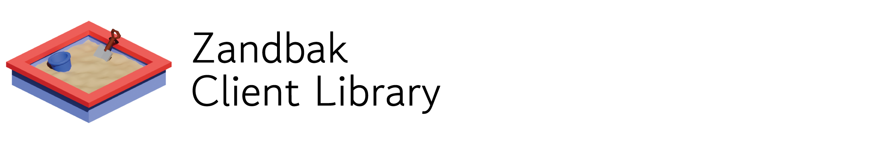

The Zandbak Client Library is a Unity package designed to facilitate the creation of networked, shared social VR experiences. It provides a high-level API for interacting with the [Orchestrator backend](https://github.com/cwi-dis/zandbak-orchestrator), managing sessions, user synchronization, shared objects, and real-time communication. This repository contains the library itself under `nl.cwi.dis.induxr/` and a minimal sample application under `OrchestratorSample/`.

## Features

- **Session Management**: Create, join, leave, and list sessions.
- **User Authentication**: Simple login/logout system with support for device types (VR, AR, etc.).
- **Shared Objects**: Synchronize transforms and state of game objects across participants with ownership management.
- **Triggers**: Event-based synchronization using JSON payloads.
- **Conversation Bubbles**: Dynamic group management for focused interactions (e.g., spatial audio groups).
- **Real-time Broadcasts**: Send and receive custom data messages over Socket.IO channels.
- **Voice Support**: Integrated voice transmitter and receiver components (utilizing Concentus for Opus).
- **Avatar Synchronization**: Base behaviours for local and remote avatars, including support for Skinned Meshes and XR Origins.

## Requirements

- **Unity**: 6000.0 or newer.
- **Dependencies**:
  - `com.itisnajim.socketiounity` (1.1.4)
  - `com.unity.nuget.newtonsoft-json` (3.2.1)
  - `com.unity.xr.interaction.toolkit` (3.3.1)
  - `com.unity.xr.core-utils` (for XR Origin support)
  - **Concentus**: Included in the `Plugins` folder (Opus codec implementation).

## Setup

Before you start, make sure to get and set up the [Zandbak Orchestrator](https://github.com/cwi-dis/zandbak-orchestrator), as this library is designed to work in tandem with it.

1. **Installation**: Add the package in `nl.cwi.dis.induxr/` to your Unity project via the Package Manager (using the git URL or local path).
2. **Orchestrator Controller**: Add the `OrchestratorController` prefab (found in `Runtime/Orchestrator/Prefabs`) to your initial scene.
3. **Configuration**:
   - Use `OrchestratorController.Instance.SocketConnectAsync(url)` to establish a connection to your Orchestrator backend.
   - The connection returns an `App.Orchestrator` instance which serves as the primary entry point for the API.

## Getting Started (Minimal Application)

The folder `OrchestratorSample/` provides a minimal sample application. You can run it by adding the folder as a new project in Unity Hub. The following sections give a high-level overview of its functionality:

### 1. Establish Connection & Login
Establish a connection to the Orchestrator and log in with a username.

```csharp
using Orchestrator.Wrapping;
using Newtonsoft.Json.Linq;
// ...

// 1. Connect
var orchestrator = await OrchestratorController.Instance.SocketConnectAsync("https://your-orchestrator-url");

// 2. Login
var userId = await orchestrator.Login("Username", "OptionalPassword");
```

### 2. Session Management
Once logged in, you can list, create, or join sessions.

```csharp
// List available sessions
var sessions = await orchestrator.GetSessions();

// Join the first available session
if (sessions.Count > 0) {
    var joinedSession = await orchestrator.JoinSession(sessions[0].Id);
}

// Or create a new one (requires a Room object, obtainable via GetRooms())
var rooms = await orchestrator.GetRooms();
var newSession = await orchestrator.CreateSession("My Session", rooms[0]);
```

### 3. In-Session Interaction
After joining a session, you can access it via `OrchestratorController.Instance.Orchestrator.CurrentSession`.

#### Handle Users & Avatars
Listen for users joining/leaving to manage their representations.

```csharp
var session = OrchestratorController.Instance.Orchestrator.CurrentSession;

session.OnUserJoined += (user) => {
    Debug.Log($"{user.Name} joined!");
    // Instantiate remote avatar
};
```

#### Shared Objects & Triggers
Use `TriggerBehaviour` for event-based synchronization.

```csharp
// Sending a trigger
var data = new JObject { { "action", "pulse" } };
triggerBehaviour.PublishTrigger(data);

// Receiving a trigger
triggerBehaviour.OnTriggerReceived += (data) => {
    Debug.Log($"Action received: {data.Value["action"]}");
};
```

### 4. Local Avatar Setup
To synchronize your movement with other participants, you need to set up a local avatar.

#### Create an Avatar Prefab
1. Create a 3D model with a `SkinnedMeshRenderer`.
2. Attach the `LocalAvatar` component to the prefab.
3. (Optional) Assign a `Notification` object to be shown when the user's hand is raised.

#### Instantiate & Initialize
After joining a session, instantiate your avatar and link it to the current user.

```csharp
using Orchestrator.Behaviour.Avatar;
// ...

var session = OrchestratorController.Instance.Orchestrator.CurrentSession;
var user = session.Self;

// Instantiate the prefab
var localAvatar = Instantiate(localPlayerPrefab, spawnPos, Quaternion.identity).GetComponent<LocalAvatar>();

// Initialize with the SelfUser object
localAvatar.Initialize(user);
```

The `LocalAvatar` component will automatically start broadcasting bone transformations from the `SkinnedMeshRenderer` to other participants at the specified `updateRate`.

### 5. Shared Objects (Transform Sync)
`SharedObjectBehaviour` synchronizes the position and rotation of GameObjects across all participants.

#### Setup
1. Attach `SharedObjectBehaviour` to your GameObject.
2. **Stable Identity**: Ensure the GameObject has a unique name or a stable path in the scene hierarchy. The package uses `StableObjectId.GetSceneObjectId(gameObject)` to generate a persistent ID for synchronization.
3. **Physics**: (Optional) Attach a `Rigidbody`. When a client does not own the object, the behaviour automatically sets `isKinematic = true` to prevent physics conflicts during interpolation.

#### Ownership Management
Only the owner can broadcast transform updates. Others will interpolate towards the received data. You can request ownership using `ClaimObject()`:

```csharp
using Orchestrator.Behaviour.Shared;
// ...

private async void OnMouseDown() {
    var sharedObject = GetComponent<SharedObjectBehaviour>();
    
    // Request ownership from the server
    bool success = await sharedObject.ClaimObject();
    if (success) {
        // You are now the owner and can move the object locally
        Debug.Log("Ownership claimed!");
    }
}
```

*Note: For XR, use the provided `XRClaimOnGrab` helper component to handle ownership automatically when using the XR Interaction Toolkit.*

#### Prefab Registries
The library uses `ScriptableObject` registries to manage prefabs for shared objects and avatars.
- **SharedObjectPrefabRegistry**: Maps prefab names to `GameObject` assets.
- **AvatarPrefabRegistry**: Specialized registry for avatars, allowing for a default avatar if a specific one is not found.
- **Prefab Selection**: Use the `[PrefabNameSelection(nameof(registryField))]` attribute on string fields to provide a dropdown of available prefab names in the Inspector.

### 6. Triggers (Event Sync)
`TriggerBehaviour` synchronizes discrete events or state changes using JSON (`JObject`) payloads.

#### Setup
1. Attach `TriggerBehaviour` to a GameObject.
2. Like shared objects, these rely on stable scene paths for identification.

#### Publishing & Receiving
```csharp
using Orchestrator.Behaviour.Shared;
using Orchestrator.Data;
using Newtonsoft.Json.Linq;
// ...

private TriggerBehaviour _trigger;

void Start() {
    _trigger = GetComponent<TriggerBehaviour>();
    // Subscribe to events
    _trigger.OnTriggerReceived += (TriggerData data) => {
        int counter = data.Value.Value<int>("counter");
        Debug.Log($"Counter updated to: {counter}");
    };
}

// Publish an event (e.g., on collision)
void OnTriggerEnter(Collider other) {
    var payload = new JObject { { "counter", 1 } };
    _trigger.PublishTrigger(payload);
}
```

## Behaviour Feature Overview

The package provides several MonoBehaviours categorized by their functional area in `Runtime/Orchestrator/Behaviour/`.

### Avatar
Synchronizes player representations across the network. All avatars should inherit from `AvatarBehaviour` and be initialized via `Initialize(user)`.
- **SimpleAvatarBehaviour**: Synchronizes the root transform (position and rotation). Ideal for simple 3D representations or early prototyping.
- **SkinnedMeshAvatarBehaviour**: Captures and synchronizes bone transformations from a `SkinnedMeshRenderer`. 
- **XRAvatarBehaviour**: Specifically for XR Origins. Synchronizes the root, head (camera), and both hands.
- **LocalAvatar**: (Legacy/Obsolete) Attached to the local player's prefab. It captures bone transformations from a `SkinnedMeshRenderer` and broadcasts them to the session. Supports hand-raising notifications.

### Shared
Core synchronization components for scene objects.
- **SharedObjectBehaviour**: Provides continuous transform (position/rotation) synchronization for any GameObject. Uses ownership-based broadcasting where only the current "owner" sends updates.
- **TriggerBehaviour**: Enables event-driven synchronization. Allows sending and receiving arbitrary JSON payloads (`JObject`) linked to a specific GameObject, useful for interactions like button presses or state changes.

### Grab
Helpers for managing ownership during user interactions.
- **ClaimOnGrab**: A mouse/touch interaction helper that automatically calls `ClaimObject()` on a `SharedObjectBehaviour` when the object is clicked and dragged.
- **XRClaimOnGrab**: An XR-specific helper that integrates with the *Unity XR Interaction Toolkit*. It automatically requests ownership when an interactable is selected (grabbed) and cancels the interaction if the claim fails.

### Voice
High-quality, low-latency audio communication utilizing the Opus codec.
- **VoiceTransmitter**: Captures audio from the local microphone, encodes it using Concentus (Opus), and broadcasts it to the "voice" channel in the session. Supports push-to-talk and peak level monitoring.
- **VoiceReceiver**: Listens for audio broadcasts from other participants. It dynamically creates 3D spatialized audio sources for each user and attaches them to their corresponding avatars.

## Core Entry Points
- `Orchestrator.App.Orchestrator`: The main class for handling login, sessions, and room management. Obtain an instance via `OrchestratorController.Instance.Orchestrator`.
- `Orchestrator.Wrapping.OrchestratorController`: A MonoBehaviour singleton that manages the socket connection and dispatches events. Add the `OrchestratorController` prefab to your scene to get started.

## Configuration & Automation
- **Backend URL**: Typically configured via code when calling `SocketConnectAsync(url)`.
- **Scripts**: No external build or deployment scripts are bundled directly within the package folder.

## Package Structure

```text
nl.cwi.dis.induxr/
├── Plugins/            # Third-party libraries (Concentus/Opus)
├── Runtime/
│   └── Orchestrator/
│       ├── App/        # High-level Application API
│       ├── Behaviour/  # Unity MonoBehaviours (Shared Objects, Voice, Avatars)
│       ├── Prefabs/    # Ready-to-use Unity Prefabs
│       ├── Util/       # Utilities (Versioning, ID generation)
└── package.json        # Package manifest
```

## License

This project is licensed under the BSD 2-Clause License. See the [LICENSE](LICENSE) file for details.

Copyright (c) 2026, Thomas Röggla, cwi-dis. All rights reserved.
